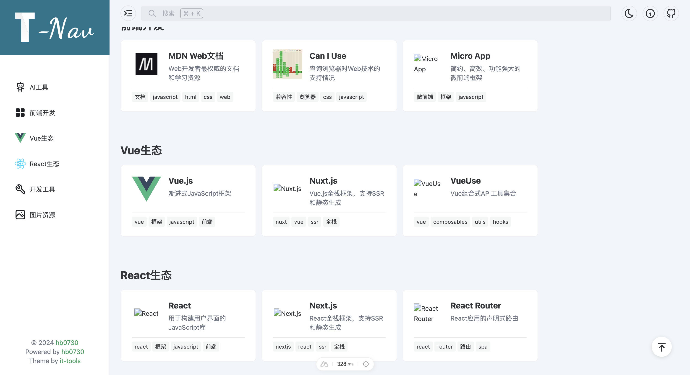
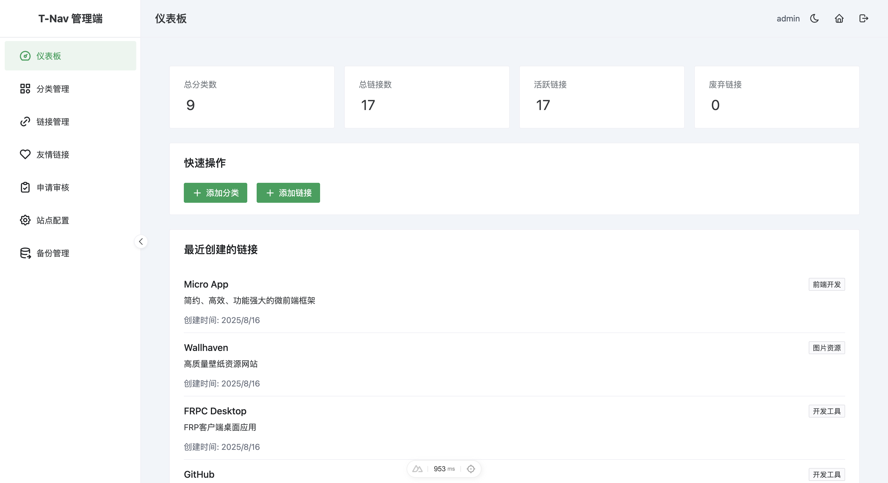

# T-Nav 导航网站

<!--图片左右 screenshots-->
<p align="center">
  
  
</p>

## 📖 项目介绍

[T-Nav](https://t-nav.hb0730.me) 是一个基于 **Nuxt 4 + Naive UI + Prisma** 开发的现代化导航网站，专为开发者和技术爱好者设计。提供丰富的技术资源导航，支持分类管理、友链申请、用户管理等功能。

### ✨ 特性

- 🎨 **现代化界面** - 基于 Naive UI 的精美设计
- 🗂️ **分类管理** - 灵活的分类和链接管理
- 🔍 **智能搜索** - 支持全文搜索和快速检索
- 👥 **用户系统** - 完整的用户认证和权限管理
- 📝 **申请审核** - 友链和网站提交审核流程
- 📱 **响应式设计** - 完美适配各种设备
- 🌙 **主题切换** - 支持明暗主题切换
- ⚡ **性能优化** - SSR支持，快速加载
- 🗄️ **数据库驱动** - 基于 Prisma + SQLite

## 🚀 快速开始

### 环境要求

- Node.js 22+ (推荐使用 [volta](https://volta.sh/) 管理版本)
- pnpm 10+

### 安装和运行

```bash
# 克隆项目
git clone https://github.com/hb0730/t-nav.git
cd t-nav

# 安装依赖
pnpm install

# 初始化数据库
pnpm run db:push

# 添加测试数据
pnpm run db:seed

# 启动开发服务器
pnpm run dev
```

项目将在 `http://localhost:3000` 运行。

默认管理员账号：
- 用户名：`admin`
- 密码：`admin123`

### 生产部署

```bash
# 构建项目
pnpm run build

# 预览构建结果
pnpm run preview
```

## 🗄️ 数据库管理

项目使用 Prisma ORM 管理数据库，支持多种数据库类型。

### 常用命令

```bash
# 生成 Prisma 客户端
pnpm run db:generate

# 推送数据库架构
pnpm run db:push

# 运行数据库迁移
pnpm run db:migrate

# 打开数据库管理界面
pnpm run db:studio

# 重置并添加测试数据
pnpm run db:seed
```

### 数据模型

项目包含以下主要数据模型：

- **User** - 用户管理
- **Category** - 分类管理
- **Link** - 链接管理
- **FriendLink** - 友链管理
- **LinkSubmission** - 链接申请
- **FriendLinkSubmission** - 友链申请
- **SiteConfig** - 站点配置

## ⚙️ 配置说明

### 环境变量

创建 `.env` 文件：

```env
# 数据库连接
DATABASE_URL="file:./dev.db"

# JWT 密钥
JWT_SECRET="your-jwt-secret-key"
```

### 站点配置

站点配置通过数据库 `SiteConfig` 模型管理，支持动态配置：

- 网站名称和描述
- SEO 关键词
- 作者信息
- 网站图标和 Logo
- ICP 备案号

## 📂 项目结构

```
t-nav/
├── components/          # Vue 组件
├── composables/         # 组合式函数
├── layouts/             # 布局组件
├── pages/               # 页面文件
├── server/              # 服务端代码
│   ├── api/            # API 路由
│   ├── data/           # 静态数据
│   └── prisma.ts       # Prisma 客户端
├── prisma/              # 数据库相关
│   ├── schema.prisma   # 数据库架构
│   └── migrations/     # 迁移文件
├── scripts/             # 工具脚本
├── assets/              # 静态资源
└── public/              # 公共文件
```

## 🛠️ 开发指南

### 添加新分类

1. 通过管理后台添加分类
2. 配置分类图标（支持 Iconify 图标）
3. 设置分类排序

### 添加新链接

1. 管理后台创建链接
2. 选择所属分类
3. 配置链接信息和标签
4. 设置展示顺序

### 图标支持

项目支持多种图标类型：

- **Iconify 图标**：如 `i-tabler-tool`
- **本地图片**：如 `/assets/imgs/logo.png`
- **网络图片**：如 `https://example.com/logo.png`

## 📜 开发脚本

```bash
# 开发相关
pnpm run dev              # 启动开发服务器
pnpm run build            # 构建生产版本
pnpm run preview          # 预览构建结果

# 代码质量
pnpm run lint             # 代码检查
pnpm run lint:fix         # 自动修复代码问题

# 数据库相关
pnpm run db:generate      # 生成 Prisma 客户端
pnpm run db:push          # 推送数据库架构
pnpm run db:migrate       # 运行数据库迁移
pnpm run db:studio        # 打开数据库管理界面
pnpm run db:seed          # 添加测试数据

# 图标相关
pnpm run icons:generate   # 生成图标数据
pnpm run icons:safelist   # 生成图标安全列表
```

## 🤝 贡献指南

欢迎贡献代码！请遵循以下流程：

1. Fork 项目
2. 创建功能分支 (`git checkout -b feature/AmazingFeature`)
3. 提交更改 (`git commit -m 'Add some AmazingFeature'`)
4. 推送到分支 (`git push origin feature/AmazingFeature`)
5. 打开 Pull Request

### 开发规范

- 遵循 ESLint 配置
- 编写清晰的提交信息
- 添加必要的测试用例
- 更新相关文档

## 🐛 问题反馈

如果遇到问题或有建议，请通过以下方式反馈：

- 提交 [GitHub Issue](https://github.com/hb0730/t-nav/issues)
- 发送邮件至 [admin@hb0730.me](mailto:admin@hb0730.me)

## 📄 许可证

本项目基于 [MIT License](./LICENSE) 开源协议。

## 👨‍💻 作者

**hb0730**

- 网站：[https://hb0730.me](https://hb0730.me)
- GitHub：[@hb0730](https://github.com/hb0730)
- 邮箱：[admin@hb0730.me](mailto:admin@hb0730.me)

## 🙏 致谢

感谢以下开源项目：

- [Nuxt.js](https://nuxt.com/) - Vue.js 全栈框架
- [Naive UI](https://www.naiveui.com/) - Vue 3 组件库
- [Prisma](https://www.prisma.io/) - 现代数据库工具链
- [UnoCSS](https://unocss.dev/) - 原子化 CSS 引擎
- [Iconify](https://iconify.design/) - 图标框架

---

⭐ 如果这个项目对你有帮助，请给它一个 Star！
